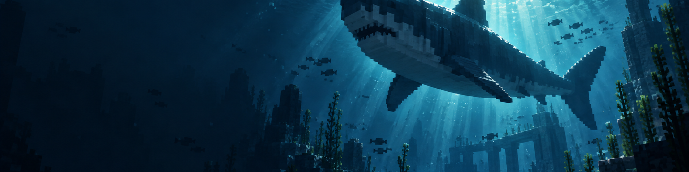

# Dwurdy Sharks

> **All the sharks. Maintained.**

<p align="center">
  
</p>

<p align="center">
  <a href="https://github.com/DurdeuVlad/dwurdy-sharks/releases"></a>
  <a href="https://github.com/DurdeuVlad/dwurdy-sharks/actions/workflows/ci.yml"></a>
  <a href="https://github.com/DurdeuVlad/dwurdy-sharks/blob/master/LICENSE"></a>
  
  
</p>

<p align="center">
  <a href="#download">Download</a> ·
  <a href="#why-the-fork">Why this fork?</a> ·
  <a href="#features">Features</a> ·
  <a href="#migration">Migration</a> ·
  <a href="#build">Build</a> ·
  <a href="#contributing">Contributing</a>
</p>

Dwurdy Sharks is a community maintenance fork of **[Ben's Sharks](https://github.com/PaoloBen/BensSharks)** by **benndevs / PaoloBen** for Minecraft 1.21.1 and NeoForge. It keeps the original ocean adventure alive while fixing a serious entity-persistence bug that could leave every large shark permanently loaded and leak server memory.

> **Respect the source.** Dwurdy Sharks is an independent fork and is not endorsed or sponsored by benndevs / PaoloBen. The original project and its creative work remain credited to the original author.

| 🌊 Deep-sea content | 🛠️ Maintained lifecycle | 🔁 Safe upgrade path |
| --- | --- | --- |
| 26 registered marine entity types, shark-tooth gear, armor, plushies, and food | Wild sharks despawn normally; tamed sharks still persist | Own `dwurdysharks` mod ID since 1.3.0 |

## Download

Get the tested build from [GitHub Releases](https://github.com/DurdeuVlad/dwurdy-sharks/releases). Place the jar in your instance or server's `mods/` folder alongside the required dependencies.

| Target | Status |
| --- | --- |
| Minecraft 1.21.1 | ✅ Verified |
| NeoForge 21.1.x | ✅ Verified |
| GeckoLib 4.x | ✅ Required |

## Why the fork?

Ben's Sharks is a great foundation, but the upstream 1.21.x build had a serious lifecycle problem: large wild sharks were made permanently persistent. On a long-running server, that meant sharks could accumulate instead of being cleaned up by normal despawning rules.

Dwurdy Sharks keeps the original content and compatibility surface while restoring the behavior players expect:

- **Wild sharks can despawn again.**
- **Tamed sharks still persist.**
- **Runs under its own `dwurdysharks` mod ID since 1.3.0.**
- **The fix tracks upstream [issue #7](https://github.com/PaoloBen/BensSharks/issues/7).**

## Features

### 🦈 A whole ocean of trouble

Explore an expanded marine roster including **Great White**, **Megalodon**, **Basking Shark**, **Axodile**, **Barracuda**, **Krill**, **Land Shark**, and more. The current build registers **26 marine entity types**, including the original mod's living entities and supporting projectile/particle entities.

### ⚔️ Shark-tooth gear

Turn the deep's most dangerous trophies into equipment and collectibles:

- Shark-tooth weapons, including the **Shark Tooth Club** and **Megalodon Tooth**
- **Jagged Armor**
- **Shark Plush**
- Food and cooking items made from the mod's marine life

### 🧹 Better server hygiene

The fork fixes the persistent-shark despawn regression without changing the intended taming behavior. That means a livelier ocean, fewer permanently loaded wild entities, and a cleaner long-running server.

## Migration

Dwurdy Sharks replaces **Ben's Sharks** on Minecraft 1.21.1.

1. Stop the game or server and make a world backup.
2. Remove the Ben's Sharks jar from `mods/`.
3. Add the Dwurdy Sharks jar.
4. Keep the rest of the modpack unchanged and launch normally.

> **⚠️ Breaking change in 1.3.0:** the mod ID changed from `benssharks` to `dwurdysharks`. Worlds saved by Ben's Sharks or Dwurdy Sharks ≤1.2.8 contain `benssharks:*` entity, item, block, effect, and sound identifiers that this build does not resolve — those objects will be missing after loading such a world under 1.3.0. **Back up your world first**, and do not load both jars at the same time.

## Requirements

- Minecraft **1.21.1**
- **NeoForge 21.1.x**
- **GeckoLib 4.x**

The currently verified target is NeoForge 1.21.1. See [docs/VERSIONS.md](docs/VERSIONS.md) for the version-branch and support policy. Future launcher listings should only advertise a Minecraft 1.12.x-or-newer target after that target has been built and tested.

## Build

Use the included Gradle wrapper from the repository root:

```text
# Windows
gradlew.bat build

# Linux / macOS
./gradlew build
```

The compiled jar is written to `build/libs/`.

## Contributing

Pull requests are welcome. Keep changes focused, preserve the original mod's attribution and LGPL-3.0 licensing, and include:

- the problem and intended behavior;
- the files or version branch affected;
- the checks or live tests you ran.

Please avoid changing the `dwurdysharks` mod ID or breaking existing world compatibility without a clear migration plan. Read [CONTRIBUTING.md](CONTRIBUTING.md) before opening a PR.

## Credits

Dwurdy Sharks is maintained by the community as a respectful continuation of **Ben's Sharks**.

- Original author: **benndevs / PaoloBen**
- Original repository: [PaoloBen/BensSharks](https://github.com/PaoloBen/BensSharks)
- Original Modrinth page: [Ben's Sharks](https://modrinth.com/mod/bens-sharks)
- Original CurseForge page: [Ben's Sharks](https://www.curseforge.com/minecraft/mc-mods/bens-sharks)

## License

Dwurdy Sharks is licensed under **[LGPL-3.0](LICENSE)**, the same license used by the upstream project.
